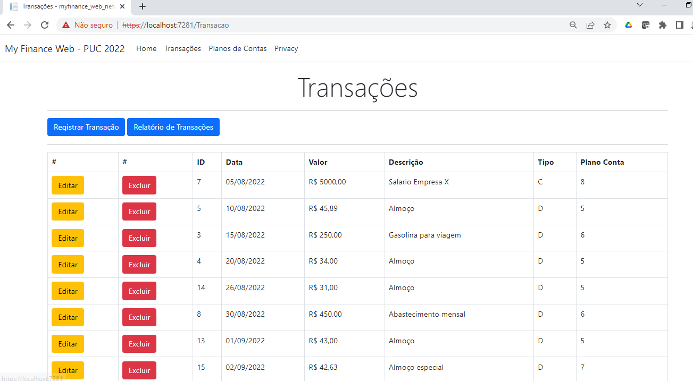
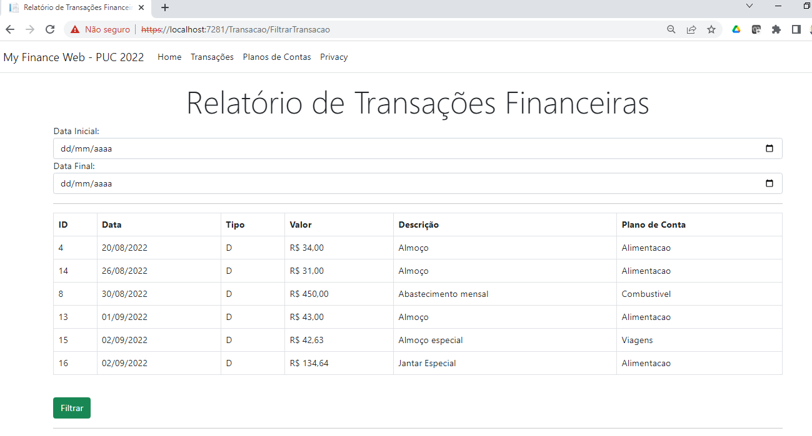
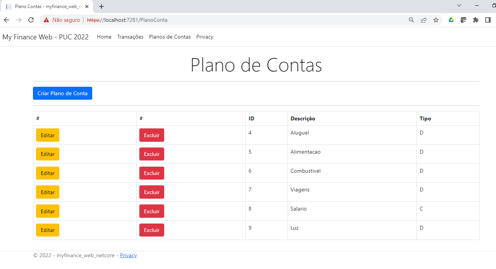

# My Finance Web

MyFinance - Projeto desenvolvido na disciplina de Práticas de Evolução de Software na PUC-MG como parte do curso de pós-graduação em engenharia de software.

## 📚Banco de Dados

A figura abaixo representa a modelagem lógica do banco de dados da aplicação no modelo de DER - Diagrama de Entidades e Relacionamentos.


A modelagem do banco de dados foi feita usando 2 tabelas: plano_contas e transacao.
- **plano_contas**: armazena os planos de contas, o tipo e a descrição
- **transacao**: armazena as transações, que envolvem algum plano de conta, armazenando data da transação, valor da transação e descrição.

O script para a criação do banco de dados está no arquivo [my_finance.sql](docs/my_finance.sql).

## 💻 Arquitetura
O projeto foi desenvolvido seguindo o padrão MVC, que divide a aplicação em três camadas: Model, View e Controller.


## 💼 Ferramentas utilizadas
No desenvolvimento do projeto, foram usadas as seguintes ferramentas:

- Git 2.37.1
- Visual Studio Code 1.71.0
- SQL Server 2019
- .NET 6
- Bootstrap 5

No projeto foi adicionado o pacote Nuget SqlClient 4.8.3.

No Visual Studio Code foi instalada a extensão C# for Visual Studio Code (powered by OmniSharp).

## ☕ Execução do Projeto
Para executar o projeto, seguir os seguintes passos:

- Clonar o [projeto](https://github.com/elmoliborio/myfinance-web-netcore.git).
- Executar no SQL Server o [script para criação das tabelas e inserção de linhas](docs/database.sql).
- Abrir a [pasta do projeto](myfinance-web-netcore) no Visual Studio Code.
- No terminal do Visual Studio Code, executar os comandos apropriados para fazer o build ou rodar o projeto:

```
dotnet build
dotnet run
```

## 💻 Telas

A seguir são apresentadas algumas telas do projeto em execução no navegador Google Chrome.

### Transações Financeiras


### Relatórios de Transações Financeiras


### Planos de Contas

<br>


